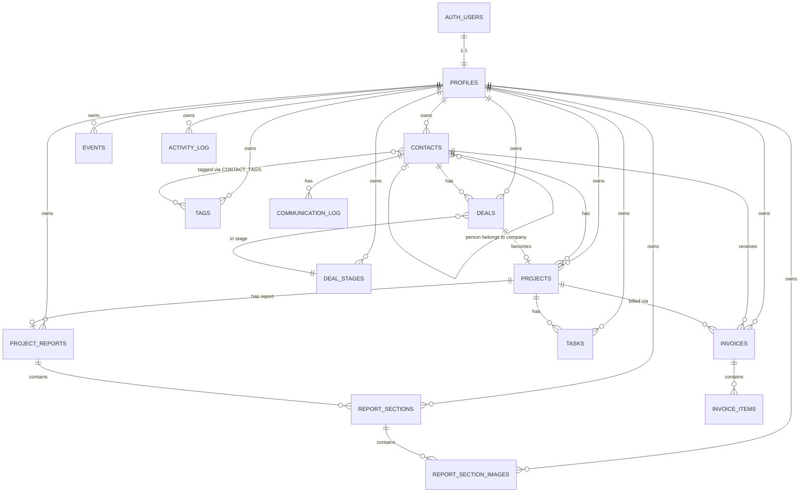

# Nexus CRM - Supabase Database Design

## Setup Instructions

The canonical all-in-one Supabase bootstrap is stored in:

```text
supabase/setup.sql
```

For a **fresh Supabase project**:

1. Create the Supabase project.
2. Open **SQL Editor**.
3. Run the complete `supabase/setup.sql` script in one go.
4. Configure Supabase Email Auth and the local/production redirect URLs.
5. Copy the project URL and application key into `.env.local`.

For an **existing production database**, use the versioned files under `supabase/migrations/` instead of rerunning the complete bootstrap script.

See [`supabase.md`](./supabase.md) for the full environment, Auth, Storage, RLS, deployment, and GitHub setup instructions.

> [!IMPORTANT]
> `supabase/setup.sql` is the consolidated source of truth for a new environment. It includes the base schema, signup trigger, task/event cascade constraints, reports, profile cover support, Storage buckets, and Storage RLS policies.

---

## Entity Relationship Diagram



---

## Tables Overview

| # | Table | Purpose | Row Count Estimate |
|---|---|---|---|
| 1 | `profiles` | User profile & business info (extends auth.users) | 1 per user |
| 2 | `contacts` | Clients, leads, partners (person or company) | ~50-500 per user |
| 3 | `tags` | Custom labels for contacts | ~10-30 per user |
| 4 | `contact_tags` | Many-to-many junction (contacts ↔ tags) | ~100-1000 per user |
| 5 | `deal_stages` | Customizable pipeline stages | ~5-8 per user |
| 6 | `deals` | Sales pipeline deals | ~20-200 per user |
| 7 | `projects` | Active work tied to deals/contacts | ~10-100 per user |
| 8 | `invoices` | Billing documents | ~20-200 per user |
| 9 | `invoice_items` | Line items for itemized invoices | ~50-500 per user |
| 10 | `tasks` | To-do items and project tasks | ~50-500 per user |
| 11 | `events` | Calendar events | ~20-200 per user |
| 12 | `communication_log` | Contact communication history | ~100-1000 per user |
| 13 | `activity_log` | System activity feed | Grows over time |
| 14 | `project_reports` | Client-facing final reports linked to projects | ~1 per project |
| 15 | `report_sections` | Ordered report sections with rich HTML content | ~3-15 per report |
| 16 | `report_section_images` | Images attached to report sections | ~0-10 per section |

---

## Table Definitions

### 1. `profiles`

Extends Supabase `auth.users`. Auto-created on signup via trigger.

| Column | Type | Constraints | Description |
|---|---|---|---|
| `id` | `uuid` | PK, FK → auth.users.id | Same as auth user ID |
| `full_name` | `text` | | User's display name |
| `avatar_url` | `text` | | Profile picture URL (Supabase Storage public URL) |
| `cover_image_url` | `text` | | Profile cover image URL (Supabase Storage public URL) |
| `business_name` | `text` | | Business/company name (for invoices) |
| `business_email` | `text` | | Business contact email |
| `business_phone` | `text` | | Business phone |
| `business_address` | `text` | | Business address (for invoices) |
| `business_logo_url` | `text` | | Logo URL (for invoices) |
| `default_currency` | `text` | DEFAULT `'USD'` | Default currency for invoices |
| `default_tax_rate` | `numeric(5,2)` | DEFAULT `0` | Default tax % |
| `payment_terms` | `text` | | Default payment terms text |
| `bank_details` | `text` | | Bank info for invoices |
| `language` | `text` | DEFAULT `'en'` | UI language (`en` or `ar`) |
| `created_at` | `timestamptz` | DEFAULT `now()` | |
| `updated_at` | `timestamptz` | DEFAULT `now()` | |

---

### 2. `contacts`

| Column | Type | Constraints | Description |
|---|---|---|---|
| `id` | `uuid` | PK, DEFAULT `gen_random_uuid()` | |
| `user_id` | `uuid` | NOT NULL, FK → profiles.id | Owner |
| `type` | `text` | NOT NULL, CHECK `('person','company')` | Entity type |
| `status` | `text` | DEFAULT `'active'`, CHECK `('active','inactive','archived')` | |
| `first_name` | `text` | | Person's first name |
| `last_name` | `text` | | Person's last name |
| `company_name` | `text` | | Company name (for type='company') |
| `company_id` | `uuid` | FK → contacts.id, nullable | Link person to their company |
| `email` | `text` | | |
| `phone` | `text` | | Legacy combined phone value kept for compatibility |
| `phone_country_code` | `text` | DEFAULT `'+20'` | Country calling code |
| `phone_number` | `text` | | Local phone number without country code |
| `nationality` | `text` | | Person nationality |
| `lead_source` | `text` | DEFAULT `'direct'` | Acquisition/source channel |
| `website` | `text` | | |
| `industry` | `text` | | |
| `location` | `text` | | City/country |
| `timezone` | `text` | | |
| `notes` | `text` | | Sanitized rich-text HTML |
| `created_at` | `timestamptz` | DEFAULT `now()` | |
| `updated_at` | `timestamptz` | DEFAULT `now()` | |

> [!NOTE]
> For `type = 'person'`: use `first_name` + `last_name`, optionally link to a company via `company_id`.
> For `type = 'company'`: use `company_name`. `first_name`/`last_name` are left null.

---

### 3. `tags`

| Column | Type | Constraints | Description |
|---|---|---|---|
| `id` | `uuid` | PK, DEFAULT `gen_random_uuid()` | |
| `user_id` | `uuid` | NOT NULL, FK → profiles.id | Owner |
| `name` | `text` | NOT NULL | Tag label |
| `color` | `text` | DEFAULT `'#94A3B8'` | Hex color |
| `created_at` | `timestamptz` | DEFAULT `now()` | |

**Unique constraint:** `(user_id, name)` - no duplicate tag names per user.

---

### 4. `contact_tags` (junction)

| Column | Type | Constraints |
|---|---|---|
| `contact_id` | `uuid` | FK → contacts.id ON DELETE CASCADE |
| `tag_id` | `uuid` | FK → tags.id ON DELETE CASCADE |

**Primary key:** `(contact_id, tag_id)`

---

### 5. `deal_stages`

| Column | Type | Constraints | Description |
|---|---|---|---|
| `id` | `uuid` | PK, DEFAULT `gen_random_uuid()` | |
| `user_id` | `uuid` | NOT NULL, FK → profiles.id | Owner |
| `name` | `text` | NOT NULL | Stage name |
| `position` | `integer` | NOT NULL | Sort order (0, 1, 2...) |
| `color` | `text` | DEFAULT `'#94A3B8'` | Stage color |
| `is_won` | `boolean` | DEFAULT `false` | Marks the "Won" stage |
| `is_lost` | `boolean` | DEFAULT `false` | Marks the "Lost" stage |
| `created_at` | `timestamptz` | DEFAULT `now()` | |

**Default stages seeded on profile creation:**

| Position | Name | Color | Won? | Lost? |
|---|---|---|---|---|
| 0 | Lead | `#94A3B8` | | |
| 1 | Contacted | `#2E6FA0` | | |
| 2 | Proposal Sent | `#49A4BB` | | |
| 3 | Negotiation | `#F59E0B` | | |
| 4 | Won | `#15D8B3` | ✅ | |
| 5 | Lost | `#EF4444` | | ✅ |

---

### 6. `deals`

| Column | Type | Constraints | Description |
|---|---|---|---|
| `id` | `uuid` | PK, DEFAULT `gen_random_uuid()` | |
| `user_id` | `uuid` | NOT NULL, FK → profiles.id | Owner |
| `contact_id` | `uuid` | NOT NULL, FK → contacts.id | Linked contact |
| `stage_id` | `uuid` | NOT NULL, FK → deal_stages.id | Current stage |
| `title` | `text` | NOT NULL | Deal name |
| `value` | `numeric(12,2)` | DEFAULT `0` | Monetary value |
| `currency` | `text` | DEFAULT `'USD'` | |
| `priority` | `text` | DEFAULT `'medium'`, CHECK `('low','medium','high','urgent')` | |
| `expected_close_date` | `date` | | When you expect to close |
| `notes` | `text` | | |
| `won_at` | `timestamptz` | | When deal was won |
| `lost_at` | `timestamptz` | | When deal was lost |
| `lost_reason` | `text` | | Why deal was lost |
| `created_at` | `timestamptz` | DEFAULT `now()` | |
| `updated_at` | `timestamptz` | DEFAULT `now()` | |

---

### 7. `projects`

| Column | Type | Constraints | Description |
|---|---|---|---|
| `id` | `uuid` | PK, DEFAULT `gen_random_uuid()` | |
| `user_id` | `uuid` | NOT NULL, FK → profiles.id | Owner |
| `contact_id` | `uuid` | NOT NULL, FK → contacts.id | Client |
| `deal_id` | `uuid` | FK → deals.id, nullable | Originating deal |
| `name` | `text` | NOT NULL | |
| `description` | `text` | | |
| `status` | `text` | DEFAULT `'not_started'`, CHECK | See statuses below |
| `start_date` | `date` | | |
| `deadline` | `date` | | |
| `budget` | `numeric(12,2)` | DEFAULT `0` | |
| `created_at` | `timestamptz` | DEFAULT `now()` | |
| `updated_at` | `timestamptz` | DEFAULT `now()` | |

**Statuses:** `not_started`, `in_progress`, `on_hold`, `completed`, `cancelled`

---

### 8. `invoices`

| Column | Type | Constraints | Description |
|---|---|---|---|
| `id` | `uuid` | PK, DEFAULT `gen_random_uuid()` | |
| `user_id` | `uuid` | NOT NULL, FK → profiles.id | Owner |
| `contact_id` | `uuid` | NOT NULL, FK → contacts.id | Bill to |
| `project_id` | `uuid` | FK → projects.id ON DELETE CASCADE, nullable | Linked project |
| `invoice_number` | `text` | NOT NULL | e.g., `INV-2026-001` |
| `pricing_type` | `text` | NOT NULL, CHECK `('itemized','fixed')` | Billing model |
| `fixed_amount` | `numeric(12,2)` | | Used when `pricing_type = 'fixed'` |
| `subtotal` | `numeric(12,2)` | DEFAULT `0` | Sum of items or fixed amount |
| `tax_rate` | `numeric(5,2)` | DEFAULT `0` | Tax percentage |
| `tax_amount` | `numeric(12,2)` | DEFAULT `0` | Calculated tax |
| `discount` | `numeric(12,2)` | DEFAULT `0` | Discount amount |
| `total` | `numeric(12,2)` | DEFAULT `0` | Final total |
| `currency` | `text` | DEFAULT `'USD'` | |
| `status` | `text` | DEFAULT `'draft'`, CHECK | See statuses below |
| `issue_date` | `date` | NOT NULL | |
| `due_date` | `date` | NOT NULL | |
| `paid_at` | `timestamptz` | | When payment was received |
| `notes` | `text` | | Terms, notes for client |
| `created_at` | `timestamptz` | DEFAULT `now()` | |
| `updated_at` | `timestamptz` | DEFAULT `now()` | |

**Statuses:** `draft`, `sent`, `paid`, `overdue`, `cancelled`

**Unique constraint:** `(user_id, invoice_number)` - no duplicate invoice numbers per user.

---

### 9. `invoice_items`

| Column | Type | Constraints | Description |
|---|---|---|---|
| `id` | `uuid` | PK, DEFAULT `gen_random_uuid()` | |
| `invoice_id` | `uuid` | NOT NULL, FK → invoices.id ON DELETE CASCADE | Parent invoice |
| `description` | `text` | NOT NULL | What this line item is for |
| `amount` | `numeric(12,2)` | NOT NULL | Price for this item |
| `position` | `integer` | NOT NULL DEFAULT `0` | Sort order |
| `created_at` | `timestamptz` | DEFAULT `now()` | |

---

### 10. `tasks`

| Column | Type | Constraints | Description |
|---|---|---|---|
| `id` | `uuid` | PK, DEFAULT `gen_random_uuid()` | |
| `user_id` | `uuid` | NOT NULL, FK → profiles.id | Owner |
| `contact_id` | `uuid` | FK → contacts.id ON DELETE CASCADE, nullable | Linked contact |
| `deal_id` | `uuid` | FK → deals.id, nullable | Linked deal |
| `project_id` | `uuid` | FK → projects.id ON DELETE CASCADE, nullable | Linked project |
| `title` | `text` | NOT NULL | |
| `description` | `text` | | |
| `priority` | `text` | DEFAULT `'medium'`, CHECK `('low','medium','high','urgent')` | |
| `status` | `text` | DEFAULT `'todo'`, CHECK `('todo','in_progress','done')` | |
| `due_date` | `timestamptz` | | |
| `completed_at` | `timestamptz` | | |
| `created_at` | `timestamptz` | DEFAULT `now()` | |
| `updated_at` | `timestamptz` | DEFAULT `now()` | |

---

### 11. `events`

| Column | Type | Constraints | Description |
|---|---|---|---|
| `id` | `uuid` | PK, DEFAULT `gen_random_uuid()` | |
| `user_id` | `uuid` | NOT NULL, FK → profiles.id | Owner |
| `title` | `text` | NOT NULL | |
| `description` | `text` | | |
| `type` | `text` | DEFAULT `'other'`, CHECK `('meeting','call','follow_up','deadline','other')` | |
| `start_time` | `timestamptz` | NOT NULL | |
| `end_time` | `timestamptz` | NOT NULL | |
| `all_day` | `boolean` | DEFAULT `false` | |
| `contact_id` | `uuid` | FK → contacts.id ON DELETE CASCADE, nullable | |
| `deal_id` | `uuid` | FK → deals.id, nullable | |
| `project_id` | `uuid` | FK → projects.id ON DELETE CASCADE, nullable | |
| `color` | `text` | | Custom color |
| `created_at` | `timestamptz` | DEFAULT `now()` | |
| `updated_at` | `timestamptz` | DEFAULT `now()` | |

---

### 12. `communication_log`

| Column | Type | Constraints | Description |
|---|---|---|---|
| `id` | `uuid` | PK, DEFAULT `gen_random_uuid()` | |
| `user_id` | `uuid` | NOT NULL, FK → profiles.id | Owner |
| `contact_id` | `uuid` | NOT NULL, FK → contacts.id | Who |
| `type` | `text` | NOT NULL, CHECK `('email','call','meeting','message','other')` | |
| `subject` | `text` | | Subject/title |
| `content` | `text` | | Details |
| `date` | `timestamptz` | NOT NULL, DEFAULT `now()` | When it happened |
| `created_at` | `timestamptz` | DEFAULT `now()` | |

---

### 14. `project_reports`

Stores one client-facing completion report per project. The application enforces one report per project per user with a unique `(user_id, project_id)` constraint.

| Column | Type | Constraints | Description |
|---|---|---|---|
| `id` | `uuid` | PK, DEFAULT `gen_random_uuid()` | |
| `user_id` | `uuid` | NOT NULL, FK → profiles.id ON DELETE CASCADE | Owner |
| `project_id` | `uuid` | NOT NULL, FK → projects.id ON DELETE CASCADE | Related project |
| `title` | `text` | NOT NULL | Report title |
| `created_at` | `timestamptz` | DEFAULT `now()` | |
| `updated_at` | `timestamptz` | DEFAULT `now()` | |

**Unique constraint:** `(user_id, project_id)` - one report per project per user.

### 15. `report_sections`

Ordered sections belonging to a report. Rich text is stored as sanitized HTML in `content_html`.

| Column | Type | Constraints | Description |
|---|---|---|---|
| `id` | `uuid` | PK, DEFAULT `gen_random_uuid()` | |
| `report_id` | `uuid` | NOT NULL, FK → project_reports.id ON DELETE CASCADE | Parent report |
| `user_id` | `uuid` | NOT NULL, FK → profiles.id ON DELETE CASCADE | Owner |
| `title` | `text` | NOT NULL | Section heading |
| `content_html` | `text` | NOT NULL DEFAULT `''` | Rich text body |
| `position` | `integer` | NOT NULL DEFAULT `0` | Display order |
| `created_at` | `timestamptz` | DEFAULT `now()` | |
| `updated_at` | `timestamptz` | DEFAULT `now()` | |

### 16. `report_section_images`

Stores references to images uploaded for individual report sections. The binary files live in Supabase Storage; the table stores their storage path and optional accessibility text.

| Column | Type | Constraints | Description |
|---|---|---|---|
| `id` | `uuid` | PK, DEFAULT `gen_random_uuid()` | |
| `report_section_id` | `uuid` | NOT NULL, FK → report_sections.id ON DELETE CASCADE | Parent section |
| `user_id` | `uuid` | NOT NULL, FK → profiles.id ON DELETE CASCADE | Owner |
| `storage_path` | `text` | NOT NULL | Supabase Storage object path |
| `alt_text` | `text` | | Image alternative text |
| `position` | `integer` | NOT NULL DEFAULT `0` | Display order |
| `created_at` | `timestamptz` | DEFAULT `now()` | |

---

### Supabase Storage

Storage setup is part of the consolidated `supabase/setup.sql` file. The application uses `profile-assets` for public profile/business images and `report-assets` for private report section images.

The application currently uses two Storage buckets: 

| Bucket | Public | Allowed types | Limit | Purpose |
|---|---|---|---:|---|
| `profile-assets` | Yes | PNG, JPEG, WebP | 5 MB | Avatar, cover image, business logo uploads |
| `report-assets` | No | PNG, JPEG, WebP | 10 MB | Report section images |

Storage object policies are scoped to the authenticated user's UUID as the first folder segment. Report image access is private and uses authenticated access/signing; profile assets are public after upload.

### 13. `activity_log`

| Column | Type | Constraints | Description |
|---|---|---|---|
| `id` | `uuid` | PK, DEFAULT `gen_random_uuid()` | |
| `user_id` | `uuid` | NOT NULL, FK → profiles.id | Owner |
| `action` | `text` | NOT NULL | `created`, `updated`, `deleted`, `status_changed`, `stage_changed` |
| `entity_type` | `text` | NOT NULL | `contact`, `deal`, `project`, `invoice`, `task` |
| `entity_id` | `uuid` | NOT NULL | ID of the affected record |
| `description` | `text` | | Human-readable description |
| `metadata` | `jsonb` | DEFAULT `'{}'` | Extra data (old/new values, etc.) |
| `created_at` | `timestamptz` | DEFAULT `now()` | |

---

## Data lifecycle and cascade behavior

The database intentionally cascades some linked records when their parent entity is removed:

- Deleting a contact cascades to linked `tasks` and `events`.
- Deleting a project cascades to linked `tasks`, `events`, and `project_reports`.
- Deleting a report cascades to `report_sections`.
- Deleting a report section cascades to `report_section_images` metadata.

The actual binary files in Supabase Storage are managed through the Storage API; deleting a database metadata row does not by itself remove a stored object.

For full account deletion, the Settings flow removes the authenticated user's objects from both Storage buckets before deleting `auth.users`.

## RLS (Row Level Security) Policies

Every table uses the same core pattern: **users can only access their own data**.

| Table | Policy | Rule |
|---|---|---|
| `profiles` | SELECT own | `id = auth.uid()` |
| `profiles` | UPDATE own | `id = auth.uid()` |
| `contacts` | ALL own | `user_id = auth.uid()` |
| `tags` | ALL own | `user_id = auth.uid()` |
| `contact_tags` | SELECT/INSERT/DELETE | `contact_id` belongs to user (via subquery) |
| `deal_stages` | ALL own | `user_id = auth.uid()` |
| `deals` | ALL own | `user_id = auth.uid()` |
| `projects` | ALL own | `user_id = auth.uid()` |
| `invoices` | ALL own | `user_id = auth.uid()` |
| `invoice_items` | ALL | `invoice_id` belongs to user (via subquery) |
| `tasks` | ALL own | `user_id = auth.uid()` |
| `events` | ALL own | `user_id = auth.uid()` |
| `communication_log` | ALL own | `user_id = auth.uid()` |
| `activity_log` | SELECT/INSERT own | `user_id = auth.uid()` |
| `project_reports` | ALL own | `user_id = auth.uid()` |
| `report_sections` | ALL own + report ownership | `user_id = auth.uid()` and parent report belongs to user |
| `report_section_images` | ALL own + section ownership | `user_id = auth.uid()` and parent section belongs to user |

> [!CAUTION]
> RLS is **enabled on all tables**. Without these policies, no data is accessible. The SQL script below handles everything.

---

## Indexes

Performance indexes on frequently queried columns:

| Table | Index On | Reason |
|---|---|---|
| `contacts` | `user_id` | Filter by owner |
| `contacts` | `user_id, type` | Filter person vs company |
| `contacts` | `user_id, status` | Filter active/archived |
| `deals` | `user_id` | Filter by owner |
| `deals` | `user_id, stage_id` | Pipeline view |
| `deals` | `contact_id` | Contact's deals |
| `projects` | `user_id` | Filter by owner |
| `projects` | `contact_id` | Contact's projects |
| `invoices` | `user_id` | Filter by owner |
| `invoices` | `contact_id` | Contact's invoices |
| `invoices` | `user_id, status` | Filter by status |
| `invoice_items` | `invoice_id` | Invoice's items |
| `tasks` | `user_id` | Filter by owner |
| `tasks` | `user_id, status` | Filter by status |
| `tasks` | `user_id, due_date` | Due date queries |
| `events` | `user_id, start_time` | Calendar range queries |
| `activity_log` | `user_id, created_at` | Recent activity feed |
| `communication_log` | `contact_id` | Contact's history |
| `project_reports` | `user_id`, `project_id` | User/report and project lookups |
| `report_sections` | `report_id, position` | Ordered report sections |
| `report_section_images` | `report_section_id, position` | Ordered section images |

---

## Triggers

### 1. Auto-create profile on signup
When a new user signs up via Supabase Auth, automatically create a `profiles` row and seed default deal stages.

### 2. Auto-update `updated_at`
On every UPDATE to tables with `updated_at`, automatically set it to `now()`. This includes the report tables `project_reports` and `report_sections` created by the extension migration.

---

## Full SQL Script

> [!IMPORTANT]
> Copy everything below and paste it into **Supabase SQL Editor → New Query → Run**.

```sql
-- ============================================================
-- NEXUS CRM - FULL DATABASE SETUP
-- Run this entire script in Supabase SQL Editor
-- ============================================================

-- ============================================================
-- 1. PROFILES
-- ============================================================
CREATE TABLE profiles (
  id            uuid PRIMARY KEY REFERENCES auth.users(id) ON DELETE CASCADE,
  full_name     text,
  avatar_url    text,
  business_name text,
  business_email text,
  business_phone text,
  business_address text,
  business_logo_url text,
  default_currency text DEFAULT 'USD',
  default_tax_rate numeric(5,2) DEFAULT 0,
  payment_terms text,
  bank_details  text,
  language      text DEFAULT 'en',
  created_at    timestamptz DEFAULT now(),
  updated_at    timestamptz DEFAULT now()
);

ALTER TABLE profiles ENABLE ROW LEVEL SECURITY;

CREATE POLICY "Users can view own profile"
  ON profiles FOR SELECT USING (id = auth.uid());
CREATE POLICY "Users can update own profile"
  ON profiles FOR UPDATE USING (id = auth.uid());

-- ============================================================
-- 2. CONTACTS
-- ============================================================
CREATE TABLE contacts (
  id            uuid PRIMARY KEY DEFAULT gen_random_uuid(),
  user_id       uuid NOT NULL REFERENCES profiles(id) ON DELETE CASCADE,
  type          text NOT NULL CHECK (type IN ('person', 'company')),
  status        text DEFAULT 'active' CHECK (status IN ('active', 'inactive', 'archived')),
  first_name    text,
  last_name     text,
  company_name  text,
  company_id    uuid REFERENCES contacts(id) ON DELETE SET NULL,
  email         text,
  phone         text,
  website       text,
  industry      text,
  location      text,
  timezone      text,
  notes         text,
  created_at    timestamptz DEFAULT now(),
  updated_at    timestamptz DEFAULT now()
);

CREATE INDEX idx_contacts_user_id ON contacts(user_id);
CREATE INDEX idx_contacts_user_type ON contacts(user_id, type);
CREATE INDEX idx_contacts_user_status ON contacts(user_id, status);

ALTER TABLE contacts ENABLE ROW LEVEL SECURITY;

CREATE POLICY "Users can manage own contacts"
  ON contacts FOR ALL USING (user_id = auth.uid());

-- ============================================================
-- 3. TAGS
-- ============================================================
CREATE TABLE tags (
  id         uuid PRIMARY KEY DEFAULT gen_random_uuid(),
  user_id    uuid NOT NULL REFERENCES profiles(id) ON DELETE CASCADE,
  name       text NOT NULL,
  color      text DEFAULT '#94A3B8',
  created_at timestamptz DEFAULT now(),
  UNIQUE(user_id, name)
);

ALTER TABLE tags ENABLE ROW LEVEL SECURITY;

CREATE POLICY "Users can manage own tags"
  ON tags FOR ALL USING (user_id = auth.uid());

-- ============================================================
-- 4. CONTACT_TAGS (junction)
-- ============================================================
CREATE TABLE contact_tags (
  contact_id uuid NOT NULL REFERENCES contacts(id) ON DELETE CASCADE,
  tag_id     uuid NOT NULL REFERENCES tags(id) ON DELETE CASCADE,
  PRIMARY KEY (contact_id, tag_id)
);

ALTER TABLE contact_tags ENABLE ROW LEVEL SECURITY;

CREATE POLICY "Users can manage own contact tags"
  ON contact_tags FOR ALL
  USING (
    EXISTS (
      SELECT 1 FROM contacts WHERE contacts.id = contact_tags.contact_id AND contacts.user_id = auth.uid()
    )
  );

-- ============================================================
-- 5. DEAL STAGES
-- ============================================================
CREATE TABLE deal_stages (
  id         uuid PRIMARY KEY DEFAULT gen_random_uuid(),
  user_id    uuid NOT NULL REFERENCES profiles(id) ON DELETE CASCADE,
  name       text NOT NULL,
  position   integer NOT NULL,
  color      text DEFAULT '#94A3B8',
  is_won     boolean DEFAULT false,
  is_lost    boolean DEFAULT false,
  created_at timestamptz DEFAULT now()
);

ALTER TABLE deal_stages ENABLE ROW LEVEL SECURITY;

CREATE POLICY "Users can manage own deal stages"
  ON deal_stages FOR ALL USING (user_id = auth.uid());

-- ============================================================
-- 6. DEALS
-- ============================================================
CREATE TABLE deals (
  id                  uuid PRIMARY KEY DEFAULT gen_random_uuid(),
  user_id             uuid NOT NULL REFERENCES profiles(id) ON DELETE CASCADE,
  contact_id          uuid NOT NULL REFERENCES contacts(id) ON DELETE CASCADE,
  stage_id            uuid NOT NULL REFERENCES deal_stages(id) ON DELETE RESTRICT,
  title               text NOT NULL,
  value               numeric(12,2) DEFAULT 0,
  currency            text DEFAULT 'USD',
  priority            text DEFAULT 'medium' CHECK (priority IN ('low', 'medium', 'high', 'urgent')),
  expected_close_date date,
  notes               text,
  won_at              timestamptz,
  lost_at             timestamptz,
  lost_reason         text,
  created_at          timestamptz DEFAULT now(),
  updated_at          timestamptz DEFAULT now()
);

CREATE INDEX idx_deals_user_id ON deals(user_id);
CREATE INDEX idx_deals_user_stage ON deals(user_id, stage_id);
CREATE INDEX idx_deals_contact ON deals(contact_id);

ALTER TABLE deals ENABLE ROW LEVEL SECURITY;

CREATE POLICY "Users can manage own deals"
  ON deals FOR ALL USING (user_id = auth.uid());

-- ============================================================
-- 7. PROJECTS
-- ============================================================
CREATE TABLE projects (
  id          uuid PRIMARY KEY DEFAULT gen_random_uuid(),
  user_id     uuid NOT NULL REFERENCES profiles(id) ON DELETE CASCADE,
  contact_id  uuid NOT NULL REFERENCES contacts(id) ON DELETE CASCADE,
  deal_id     uuid REFERENCES deals(id) ON DELETE SET NULL,
  name        text NOT NULL,
  description text,
  status      text DEFAULT 'not_started' CHECK (status IN ('not_started', 'in_progress', 'on_hold', 'completed', 'cancelled')),
  start_date  date,
  deadline    date,
  budget      numeric(12,2) DEFAULT 0,
  created_at  timestamptz DEFAULT now(),
  updated_at  timestamptz DEFAULT now()
);

CREATE INDEX idx_projects_user_id ON projects(user_id);
CREATE INDEX idx_projects_contact ON projects(contact_id);

ALTER TABLE projects ENABLE ROW LEVEL SECURITY;

CREATE POLICY "Users can manage own projects"
  ON projects FOR ALL USING (user_id = auth.uid());

-- ============================================================
-- 8. INVOICES
-- ============================================================
CREATE TABLE invoices (
  id              uuid PRIMARY KEY DEFAULT gen_random_uuid(),
  user_id         uuid NOT NULL REFERENCES profiles(id) ON DELETE CASCADE,
  contact_id      uuid NOT NULL REFERENCES contacts(id) ON DELETE CASCADE,
  project_id      uuid REFERENCES projects(id) ON DELETE SET NULL,
  invoice_number  text NOT NULL,
  pricing_type    text NOT NULL CHECK (pricing_type IN ('itemized', 'fixed')),
  fixed_amount    numeric(12,2),
  subtotal        numeric(12,2) DEFAULT 0,
  tax_rate        numeric(5,2) DEFAULT 0,
  tax_amount      numeric(12,2) DEFAULT 0,
  discount        numeric(12,2) DEFAULT 0,
  total           numeric(12,2) DEFAULT 0,
  currency        text DEFAULT 'USD',
  status          text DEFAULT 'draft' CHECK (status IN ('draft', 'sent', 'paid', 'overdue', 'cancelled')),
  issue_date      date NOT NULL,
  due_date        date NOT NULL,
  paid_at         timestamptz,
  notes           text,
  created_at      timestamptz DEFAULT now(),
  updated_at      timestamptz DEFAULT now(),
  UNIQUE(user_id, invoice_number)
);

CREATE INDEX idx_invoices_user_id ON invoices(user_id);
CREATE INDEX idx_invoices_contact ON invoices(contact_id);
CREATE INDEX idx_invoices_user_status ON invoices(user_id, status);

ALTER TABLE invoices ENABLE ROW LEVEL SECURITY;

CREATE POLICY "Users can manage own invoices"
  ON invoices FOR ALL USING (user_id = auth.uid());

-- ============================================================
-- 9. INVOICE ITEMS
-- ============================================================
CREATE TABLE invoice_items (
  id          uuid PRIMARY KEY DEFAULT gen_random_uuid(),
  invoice_id  uuid NOT NULL REFERENCES invoices(id) ON DELETE CASCADE,
  description text NOT NULL,
  amount      numeric(12,2) NOT NULL,
  position    integer NOT NULL DEFAULT 0,
  created_at  timestamptz DEFAULT now()
);

CREATE INDEX idx_invoice_items_invoice ON invoice_items(invoice_id);

ALTER TABLE invoice_items ENABLE ROW LEVEL SECURITY;

CREATE POLICY "Users can manage own invoice items"
  ON invoice_items FOR ALL
  USING (
    EXISTS (
      SELECT 1 FROM invoices WHERE invoices.id = invoice_items.invoice_id AND invoices.user_id = auth.uid()
    )
  );

-- ============================================================
-- 10. TASKS
-- ============================================================
CREATE TABLE tasks (
  id           uuid PRIMARY KEY DEFAULT gen_random_uuid(),
  user_id      uuid NOT NULL REFERENCES profiles(id) ON DELETE CASCADE,
  contact_id   uuid REFERENCES contacts(id) ON DELETE SET NULL,
  deal_id      uuid REFERENCES deals(id) ON DELETE SET NULL,
  project_id   uuid REFERENCES projects(id) ON DELETE SET NULL,
  title        text NOT NULL,
  description  text,
  priority     text DEFAULT 'medium' CHECK (priority IN ('low', 'medium', 'high', 'urgent')),
  status       text DEFAULT 'todo' CHECK (status IN ('todo', 'in_progress', 'done')),
  due_date     timestamptz,
  completed_at timestamptz,
  created_at   timestamptz DEFAULT now(),
  updated_at   timestamptz DEFAULT now()
);

CREATE INDEX idx_tasks_user_id ON tasks(user_id);
CREATE INDEX idx_tasks_user_status ON tasks(user_id, status);
CREATE INDEX idx_tasks_user_due ON tasks(user_id, due_date);

ALTER TABLE tasks ENABLE ROW LEVEL SECURITY;

CREATE POLICY "Users can manage own tasks"
  ON tasks FOR ALL USING (user_id = auth.uid());

-- ============================================================
-- 11. EVENTS
-- ============================================================
CREATE TABLE events (
  id          uuid PRIMARY KEY DEFAULT gen_random_uuid(),
  user_id     uuid NOT NULL REFERENCES profiles(id) ON DELETE CASCADE,
  title       text NOT NULL,
  description text,
  type        text DEFAULT 'other' CHECK (type IN ('meeting', 'call', 'follow_up', 'deadline', 'other')),
  start_time  timestamptz NOT NULL,
  end_time    timestamptz NOT NULL,
  all_day     boolean DEFAULT false,
  contact_id  uuid REFERENCES contacts(id) ON DELETE SET NULL,
  deal_id     uuid REFERENCES deals(id) ON DELETE SET NULL,
  project_id  uuid REFERENCES projects(id) ON DELETE SET NULL,
  color       text,
  created_at  timestamptz DEFAULT now(),
  updated_at  timestamptz DEFAULT now()
);

CREATE INDEX idx_events_user_time ON events(user_id, start_time);

ALTER TABLE events ENABLE ROW LEVEL SECURITY;

CREATE POLICY "Users can manage own events"
  ON events FOR ALL USING (user_id = auth.uid());

-- ============================================================
-- 12. COMMUNICATION LOG
-- ============================================================
CREATE TABLE communication_log (
  id         uuid PRIMARY KEY DEFAULT gen_random_uuid(),
  user_id    uuid NOT NULL REFERENCES profiles(id) ON DELETE CASCADE,
  contact_id uuid NOT NULL REFERENCES contacts(id) ON DELETE CASCADE,
  type       text NOT NULL CHECK (type IN ('email', 'call', 'meeting', 'message', 'other')),
  subject    text,
  content    text,
  date       timestamptz NOT NULL DEFAULT now(),
  created_at timestamptz DEFAULT now()
);

CREATE INDEX idx_comms_contact ON communication_log(contact_id);

ALTER TABLE communication_log ENABLE ROW LEVEL SECURITY;

CREATE POLICY "Users can manage own communication logs"
  ON communication_log FOR ALL USING (user_id = auth.uid());

-- ============================================================
-- 13. ACTIVITY LOG
-- ============================================================
CREATE TABLE activity_log (
  id          uuid PRIMARY KEY DEFAULT gen_random_uuid(),
  user_id     uuid NOT NULL REFERENCES profiles(id) ON DELETE CASCADE,
  action      text NOT NULL,
  entity_type text NOT NULL,
  entity_id   uuid NOT NULL,
  description text,
  metadata    jsonb DEFAULT '{}',
  created_at  timestamptz DEFAULT now()
);

CREATE INDEX idx_activity_user_time ON activity_log(user_id, created_at DESC);

ALTER TABLE activity_log ENABLE ROW LEVEL SECURITY;

CREATE POLICY "Users can view own activity"
  ON activity_log FOR SELECT USING (user_id = auth.uid());
CREATE POLICY "Users can insert own activity"
  ON activity_log FOR INSERT WITH CHECK (user_id = auth.uid());

-- ============================================================
-- TRIGGERS
-- ============================================================

-- Auto-update updated_at timestamp
CREATE OR REPLACE FUNCTION update_updated_at()
RETURNS TRIGGER AS $$
BEGIN
  NEW.updated_at = now();
  RETURN NEW;
END;
$$ LANGUAGE plpgsql;

CREATE TRIGGER set_updated_at BEFORE UPDATE ON profiles
  FOR EACH ROW EXECUTE FUNCTION update_updated_at();
CREATE TRIGGER set_updated_at BEFORE UPDATE ON contacts
  FOR EACH ROW EXECUTE FUNCTION update_updated_at();
CREATE TRIGGER set_updated_at BEFORE UPDATE ON deals
  FOR EACH ROW EXECUTE FUNCTION update_updated_at();
CREATE TRIGGER set_updated_at BEFORE UPDATE ON projects
  FOR EACH ROW EXECUTE FUNCTION update_updated_at();
CREATE TRIGGER set_updated_at BEFORE UPDATE ON invoices
  FOR EACH ROW EXECUTE FUNCTION update_updated_at();
CREATE TRIGGER set_updated_at BEFORE UPDATE ON tasks
  FOR EACH ROW EXECUTE FUNCTION update_updated_at();
CREATE TRIGGER set_updated_at BEFORE UPDATE ON events
  FOR EACH ROW EXECUTE FUNCTION update_updated_at();

-- Auto-create profile + default deal stages on signup
CREATE OR REPLACE FUNCTION handle_new_user()
RETURNS TRIGGER AS $$
BEGIN
  -- Create profile
  INSERT INTO profiles (id, full_name)
  VALUES (
    NEW.id,
    COALESCE(NEW.raw_user_meta_data->>'full_name', '')
  );

  -- Seed default deal stages
  INSERT INTO deal_stages (user_id, name, position, color, is_won, is_lost) VALUES
    (NEW.id, 'Lead',          0, '#94A3B8', false, false),
    (NEW.id, 'Contacted',     1, '#2E6FA0', false, false),
    (NEW.id, 'Proposal Sent', 2, '#49A4BB', false, false),
    (NEW.id, 'Negotiation',   3, '#F59E0B', false, false),
    (NEW.id, 'Won',           4, '#15D8B3', true,  false),
    (NEW.id, 'Lost',          5, '#EF4444', false, true);

  RETURN NEW;
END;
$$ LANGUAGE plpgsql SECURITY DEFINER;

CREATE TRIGGER on_auth_user_created
  AFTER INSERT ON auth.users
  FOR EACH ROW EXECUTE FUNCTION handle_new_user();

-- ============================================================
-- DONE! Your database is ready.
-- ============================================================
```

---

## After Running the Script

1. ✅ Verify all 13 tables appear in **Table Editor**
2. ✅ Check **Authentication → Policies** - every table should show its RLS policies
3. ✅ Create a `.env.local` in your project root:

```env
NEXT_PUBLIC_SUPABASE_URL=your-project-url
NEXT_PUBLIC_SUPABASE_ANON_KEY=your-anon-key
```

4. ✅ Test by creating an account - the `profiles` row and 6 default `deal_stages` should auto-create


## Nexus CRM Application Extensions

The current application layer adds profile media and client-facing reports on top of the original CRM schema:

- `profiles.cover_image_url` stores the public Supabase Storage URL for the profile cover.
- `profiles.avatar_url` and `profiles.business_logo_url` can point to user-uploaded files in `profile-assets`.
- `project_reports` stores one final/client-facing report per project and user.
- `report_sections` stores ordered sections with rich HTML content.
- `report_section_images` stores image references and optional `alt_text` for report-section images.

The extension objects are created by `supabase/migrations/20260921_reports_and_profile_assets.sql`. This migration is additive: it uses `IF NOT EXISTS`, adds the new profile column if missing, creates the new tables/indexes/policies, and configures the two Storage buckets.

### Migration order

1. Run the original/full CRM schema once for a new Supabase project.
2. Run `supabase/migrations/20260921_reports_and_profile_assets.sql` for the current Reports + profile media features.
3. Do not rerun the full base schema on an existing production database just to obtain the extension features.

### Storage ownership model

Uploaded object paths use the authenticated user's UUID as the first folder segment. RLS/Storage policies use that folder to isolate each user's files. `profile-assets` is public because the application renders avatar/cover/logo URLs directly; `report-assets` is private because report images are accessed for authenticated report editing/printing.


## Current application additions

### Contact enrichment

Contacts support structured phone storage (`phone_country_code` + `phone_number`), nationality, and `lead_source`. The legacy `phone` column remains for backward compatibility with existing records.

### Rich text

Notes and descriptions use the same rich-text editor as Reports. Values are stored as sanitized HTML and rendered through the shared rich-text content component.

### Reports lifecycle

Reports can be edited from their detail/editor page and permanently deleted. Deleting a report removes its report rows and user-owned report image objects.

### Search and loading

List-page search uses a debounced client input with server-side query execution. Route-level loading UI and operation overlays provide feedback while asynchronous work is running.
