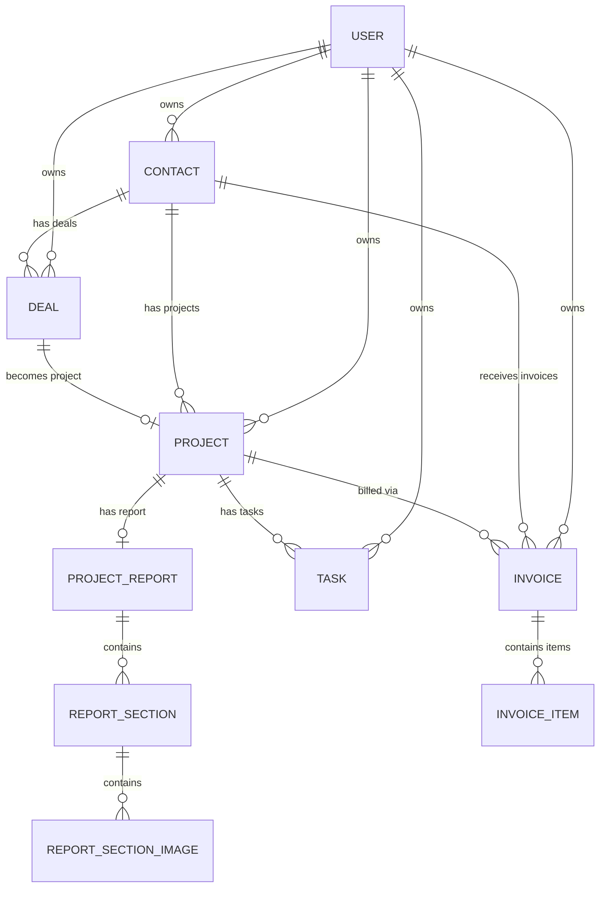

# Nexus CRM — Full System Overview

## What Is Nexus CRM?

Nexus CRM is your personal business operating system. It's the single place where you:

- **Find and manage** every client you've ever worked with
- **Track every deal** from first contact to closed/won
- **Manage projects** tied to those deals
- **Send invoices** and track payments
- **Plan your day** with tasks and calendar
- **See the health** of your business at a glance

It's designed for **multi-user access** — anyone can sign up and get their own isolated CRM workspace.

---

## User Journey & Workflow

### 1. Sign Up / Sign In

- New users register with email + password (Supabase Auth)
- After login, users land on their **Dashboard**
- Each user has their own isolated data — no cross-user visibility

### 2. Dashboard (Home)

The first thing you see after login. It answers: *"How's my business doing right now?"*

| Widget | What It Shows |
|---|---|
| **Revenue Summary** | Total revenue this month/quarter/year, compared to previous period |
| **Pipeline Overview** | Mini funnel — how many deals in each stage |
| **Recent Activity** | Last 10 actions (new contact added, deal moved, invoice sent) |
| **Upcoming Tasks** | Tasks due today and this week |
| **Quick Stats Cards** | Total clients, active deals, pending invoices, overdue tasks |

### 3. Contacts Module
The heart of the CRM. Every person you interact with lives here.

**Contact Profile includes:**
- Full name, email, phone, company, location, timezone
- Contact type: **Client**, **Lead**, **Partner**, **Other**
- **Status**: Active, Inactive, Archived
- **Notes**: Free-form notes about the person
- **Tags**: Custom labels (e.g., "WordPress", "React", "High Value")
- **Communication History**: Log of emails, calls, meetings (manual entries)
- **Linked Deals**: All deals associated with this contact
- **Linked Projects**: All projects for this contact
- **Invoices Tab**: All invoices sent to this contact (with ability to create new ones directly from the profile)

**Contact List View:**
- Searchable, filterable, sortable table
- Filter by type, status, tags
- Bulk actions (archive, tag, delete)

### 4. Deal Pipeline
Visual Kanban board to track your sales process.

**Default Stages (customizable):**
```
Lead → Contacted → Proposal Sent → Negotiation → Won → Lost
```

**Each Deal Card contains:**
- Deal title (e.g., "E-commerce Website Redesign")
- Contact (linked)
- Deal value ($)
- Expected close date
- Priority (Low, Medium, High, Urgent)
- Notes

**Interactions:**
- **Drag & drop** cards between stages
- Click a card to open deal details
- When a deal is marked **Won**, prompt to create a **Project** from it
- Filter pipeline by date range, value range, contact

### 5. Projects Module
Track active work tied to won deals.

**Project includes:**
- Project name, description
- Linked contact and deal
- Status: **Not Started**, **In Progress**, **On Hold**, **Completed**, **Cancelled**
- Start date, deadline
- Budget / deal value
- Progress indicator

**Project Detail Page:**
- Overview with key info
- Task checklist (sub-tasks specific to this project)
- Linked invoices
- Notes and files
- Client-facing final report can be created from the project/report workflow

### 6. Invoices Module ⭐
This is where the billing happens. Two pricing models supported:

---

#### Pricing Model A: Itemized (Upwork-Style)

For projects billed by deliverables/milestones:

| # | Item | Description | Amount |
|---|---|---|---|
| 1 | Homepage Design | Full responsive homepage with hero, features, footer | $500 |
| 2 | Product Page | Dynamic product listing with filters and search | $350 |
| 3 | Checkout Flow | Cart, checkout, payment integration | $400 |
| | | **Total** | **$1,250** |

Each line item is a "point" with its own price — exactly like Upwork's milestone system.

#### Pricing Model B: Fixed Price

For projects with a single agreed price:

| Project | Description | Amount |
|---|---|---|
| E-commerce Website | Full website development including design, frontend, and backend | $3,000 |

---

**Invoice Fields:**
- Invoice number (auto-generated, e.g., `INV-2026-001`)
- Issue date & due date
- Contact (auto-linked)
- Project (optional link)
- Pricing type toggle: **Itemized** or **Fixed Price**
- Line items (if itemized): description + amount per item
- Fixed amount (if fixed price)
- Subtotal, tax (optional %), discount (optional), **total**
- Status: **Draft**, **Sent**, **Paid**, **Overdue**, **Cancelled**
- Notes / terms (e.g., payment terms, bank details)

**Where to create invoices:**
- From the **Invoices** page (standalone list)
- From a **Contact Profile** → Invoices tab → "New Invoice" (auto-fills contact)
- From a **Project Detail** → "Create Invoice" (auto-fills contact + project)

**Invoice Actions:**
- **Export as PDF** — clean, branded invoice ready to send to clients
- Mark as Sent / Paid / Overdue
- Duplicate (for recurring similar invoices)

### 7. Tasks Module
Personal task management for your daily work.

**Task includes:**
- Title, description
- Priority: Low, Medium, High, Urgent
- Due date & time
- Status: To Do, In Progress, Done
- Linked to: Contact, Deal, or Project (optional)
- Tags

**Views:**
- **List view** — sortable, filterable table
- **Board view** — Kanban (To Do → In Progress → Done)

### 8. Calendar
Visual time-based planning.

- **Month / Week / Day** views
- Events sourced from:
  - Task due dates
  - Deal expected close dates
  - Manually created events (meetings, calls, follow-ups)
- Click to create new events
- Color-coded by type (task, meeting, deadline)

### 9. Analytics
Business intelligence dashboard.

**Charts & Metrics:**
- **Revenue over time** — line/bar chart (monthly, quarterly)
- **Deal conversion funnel** — how many deals move through each stage
- **Win/Loss ratio** — percentage of deals won vs lost
- **Revenue by contact** — who are your top clients
- **Invoice status breakdown** — paid vs pending vs overdue
- **Average deal size** — trend over time
- **Tasks completion rate** — productivity metric


### 10. Reports
Final project completion reports for clients. A report is linked to one project and can contain reorderable sections with rich text and images. Reports support Arabic/English output and PDF export.

**Persistence & media:**
- One report per project per user.
- Sections are persisted separately with an explicit `position`.
- Rich text is stored as HTML (`content_html`).
- Section images are stored in the private Supabase Storage `report-assets` bucket; metadata is stored in `report_section_images`.
- Images can include `alt_text` for accessibility.

- Report title
- Project/client context
- Multiple editable sections
- Rich text formatting (bold, italic, bullets, numbered lists)
- Optional section images
- Arabic RTL / English LTR PDF output
- Branded PDF using the Nexus logo and business/account owner name

### 11. Settings
System configuration.

- **Profile**: Name, email, avatar upload, cover image upload, business info
- **Business Info**: Company name, logo, address (used in invoices)
- **Invoice Defaults**: Default currency, tax rate, payment terms, bank details
- **Deal Pipeline**: Customize stage names, add/remove stages
- **Language**: Switch between English and Arabic (RTL)
- **Account Security**: Update account email and password
- **Danger Zone**: Permanently delete the account after explicit confirmation; the flow removes profile/report files from Supabase Storage and then deletes the authenticated account so user-owned CRM data cascades through the database relationships
- **Notifications**: Email notifications for overdue tasks, invoice reminders (future)

---

## Supabase / Persistence Setup

The repository includes a canonical database bootstrap at `supabase/setup.sql`. It consolidates the full Nexus CRM schema, RLS policies, timestamp triggers, signup automation, task/event cascade constraints, project reports, profile cover support, and Storage configuration into one SQL Editor script for fresh environments.

Incremental changes remain under `supabase/migrations/`. The current reports/profile-assets migration is retained as historical migration material for databases that already exist.

Supabase Storage currently contains two buckets:

- `profile-assets` — public, image-only, 5 MB limit for avatar, cover, and business logo uploads.
- `report-assets` — private, image-only, 10 MB limit for report section images.

Uploaded objects are scoped by the authenticated user's UUID in the first folder segment, and Storage policies enforce this ownership model.

### Database lifecycle

The project uses cascade relationships for contact/project-linked tasks and events, and report data cascades through project → report → section → image metadata. Storage binaries remain under the Storage service and should be deleted through the Storage API when they are no longer referenced.

### Developer setup

See `supabase.md` for the complete Supabase setup workflow, Auth configuration, environment variables, Storage details, RLS model, migration guidance, and GitHub-safe configuration rules.

## Technical Architecture & Quality

### Rendering strategy

The application uses the Next.js App Router. Data-heavy dashboard pages and detail pages are implemented as **Server Components by default**, with Supabase reads performed on the server where possible. Interactive UI such as charts, drag-and-drop, rich text editing, dialogs, theme controls, and file uploaders remains in focused Client Components. This keeps browser-side JavaScript limited to interactive areas rather than moving the whole page to the client.

### Internationalization

The application supports **English (`en`) and Arabic (`ar`)** through `next-intl`. The locale controls document language, RTL/LTR direction, translated UI strings, date/currency formatting, metadata, and report/PDF presentation.

### SEO & structured data

The app has a shared Next.js Metadata implementation for localized titles/descriptions, canonical URLs, language alternates, Open Graph/Twitter metadata, icons, robots directives, and application metadata. Structured data is emitted as JSON-LD for the application and relevant pages.

Because the CRM dashboard contains private, authenticated user data, dashboard routes are configured as non-indexable. Public/indexable pages can be added later and included in the sitemap when the product exposes public content.

### Accessibility & performance

Current implementation standards include semantic headings/landmarks, accessible labels for interactive controls, meaningful image `alt` text, keyboard-visible focus states, `next/image` for optimized images, and reduced client-side work for data fetching. The production build no longer depends on fetching Geist fonts from Google during `next build`; the UI uses a local/system font stack.

### Storage

Supabase Storage is used for profile avatar/cover/logo uploads and report section images. The profile bucket is public; the report-assets bucket is private with user-scoped Storage policies.

## How You'd Use It — A Typical Day

```
Morning:
  1. Open Nexus CRM → Dashboard
  2. See 3 tasks due today, 1 overdue invoice, 2 deals in negotiation
  3. Check calendar for today's meeting at 2 PM

Working on leads:
  4. Go to Contacts → Add a new lead from yesterday's inquiry
  5. Create a deal for them: "Mobile App Development — $5,000"
  6. Drag deal to "Contacted" stage

After sending proposal:
  7. Move deal to "Proposal Sent"
  8. Add a task: "Follow up with Ahmed in 3 days"

Deal won:
  9. Drag deal to "Won" 🎉
  10. Create a project from the deal
  11. Break project into sub-tasks

Billing:
  12. Go to the contact's profile → Invoices tab
  13. Create new invoice → Choose "Itemized"
  14. Add 4 milestone items with prices
  15. Export as PDF → Send to client

End of month:
  16. Check Analytics → See revenue trend, conversion rate
  17. Review overdue invoices → Follow up
```

---

## Navigation Structure

```
┌─────────────────────────────────────────────┐
│  SIDEBAR (always visible)                   │
│                                             │
│  🏠 Dashboard                               │
│  👥 Contacts                                │
│  💼 Deals                                   │
│  📁 Projects                                │
│  📄 Invoices                                │
│  ✅ Tasks                                    │
│  📅 Calendar                                │
│  📊 Analytics                               │
│  📑 Reports                                 │
│  ─────────────                              │
│  ⚙️ Settings                                │
│  🌐 Language (EN/AR toggle)                 │
│  🚪 Logout                                  │
└─────────────────────────────────────────────┘
```

---

## Data Relationships



> [!NOTE]
> Every entity is scoped to a **USER** — complete data isolation between accounts. Supabase Row Level Security (RLS) will enforce this at the database level.

---

## Authentication Flow

```
┌──────────┐     ┌──────────────┐     ┌───────────┐
│  Sign Up │────▶│ Supabase Auth│────▶│ Dashboard │
│  Sign In │────▶│  (email/pwd) │────▶│  (home)   │
└──────────┘     └──────────────┘     └───────────┘
                        │
                   ┌────▼─────┐
                   │ Protected│
                   │  Routes  │
                   │ Middleware│
                   └──────────┘
```

- All routes except `/sign-in` and `/sign-up` are protected
- Supabase middleware checks session on every request
- Unauthenticated users are redirected to sign-in
